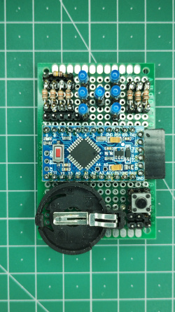
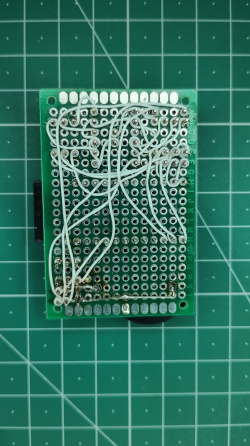

# diceForth
A electronic dice project implemented on an AVR microcontroller in FORTH

&emsp;&emsp;  

This project has the same functionality as my original [dice8051](https://github.com/martinkrebs/dice8051) project, but has been implemented in FORTH ([FlashForth](https://flashforth.com/))

The AVR board is an Arduino Nano Pro-Mini board, although I am not using any Arduino code or libs - I 'wiped it clean' and just installed FlashForth with my dice.fth word definitions.

The code is commented so if you know/read up on FORTH (FlashForth in particular) you can see how it works.

